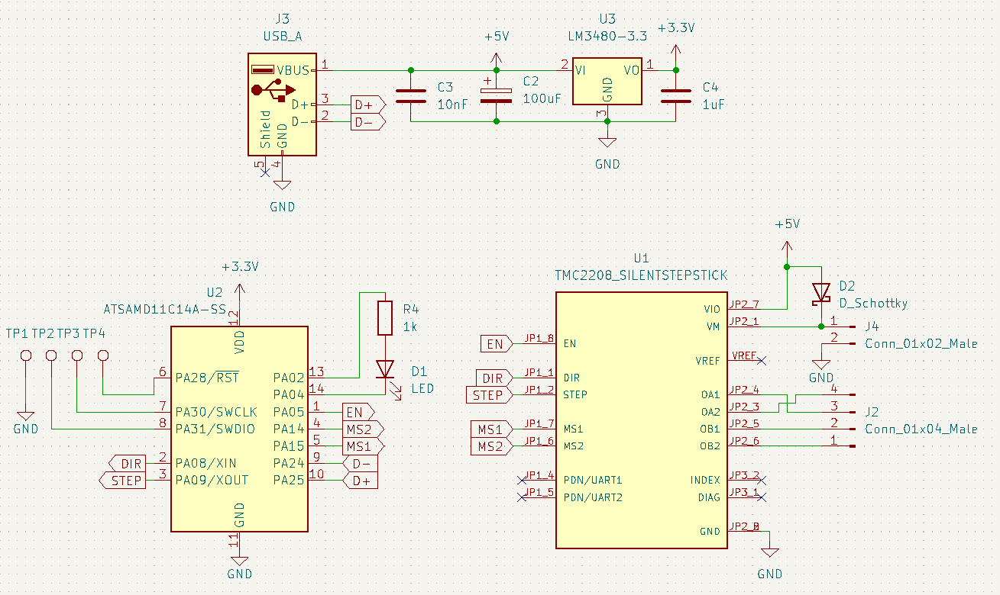
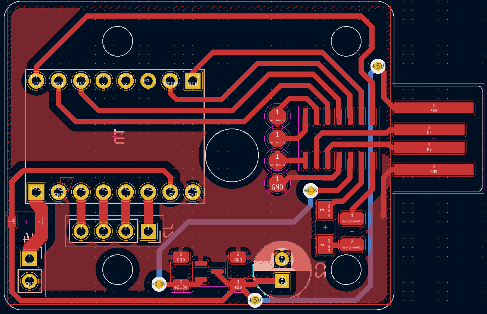
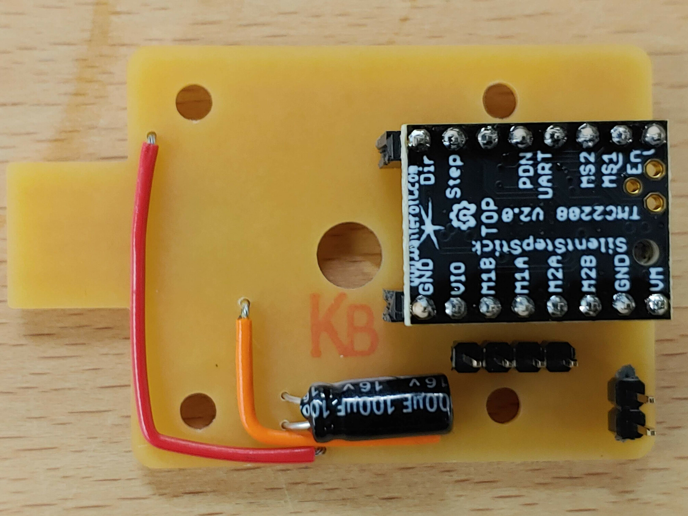
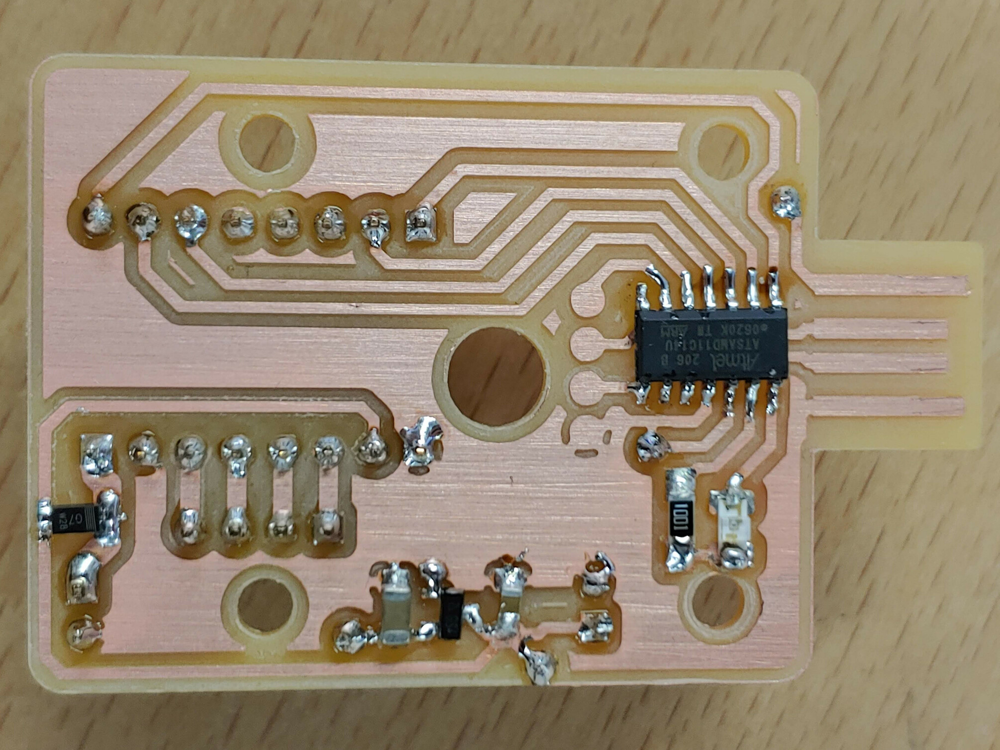

# Urumbu USB Stepper Motor

**This Project follows on from the work of Professor Neil Gershenfeld, Quentin Bolsee and Rob Hart at MIT. [Here](https://gitlab.cba.mit.edu/neilg/urumbu) is the original repository.**

## Table of Contents <!-- omit from toc -->

- [Introduction](#introduction)
- [Brief](#brief)
- [Design Aims](#design-aims)
- [PCB Design](#pcb-design)
- [Manufacturing](#manufacturing)
- [Programming](#programming)
- [Using the Module](#using-the-module)
- [Motor Module Characteristics](#motor-module-characteristics)
- [Review](#review)
- [Retrospective](#retrospective)
- [Conclusion](#conclusion)
- [Further Work](#further-work)

## Introduction

In the final year of my Bachelors degree I completed a dissertation. This repository is a summary of that work. Included in the repository is all of the information and files to reproduce and use the modules which I designed.

Bangor FabLAB needed to develop methods to teach the Fab Academy curriculum. The curriculum includes two weeks of making machines that move. Students have a very limited time to complete these projects and so they needed a flexible framework which could be used to rapidly prototype motion systems.

Traditional motion systems have all of the components plugged into the controller board. This board has firmware code to control all of the components. While prototyping, it is common to want to add parts like extra motors or switches. With this approach, the controller board must be re-designed, manufactured and programmed. This is time-consuming, creates waste, breaks the creative flow, and requires substantial skills. Students only have one week to do their projects, and this approach is not suitable.

Professor Neil Gershenfeld and his colleagues Quentin Bolsee and Rob Hart have developed a modular solution to this problem called [Urumbu](https://gitlab.cba.mit.edu/neilg/urumbu). These modules are designed to plug into a computer via a USB port. The modules move in response to serial communications from the connected computer. To add more motors to an Urumbu-based machine, the user simply plugs another motor module into the PC and adds it to their code. This is much quicker and does not break the creative flow.

## Brief

I was tasked with equipping the FabLAB to teach the machine building exercises. This involved...
- Adapting the design to meet our requirements .
- Manufacturing a set of modules.
- Testing and documenting the module characteristics to understand their capabilities.
- Demonstrating their use through building a motion system. 

## Design Aims

The original design used a DRV8428 motor driver. This motor driver causes the motor to generate noise. This driver is also surface-mount and so if the driver were to fail mid-project, it would be difficult and time-consuning to replace. 

With these issues in mind I aimed to design a module with the following characteristics:
- Use a silent, user replaceable stepper motor driver (TMC2208, StepStick socketed package).
- Able to be mounted to the back of a NEMA 14 motor.
- Able to be manufactured in the FabLAB using their isolation milling process with FR1 board.

## PCB Design

After three breadboard prototypes and six circuit board revisions I arrived at this design.

The top section is the power section which takes the five volts from the USB connection and steps it down to a stable 3.3 volts for the microcontroller. The main use for the SAMD microcontroller is to interpret the information from the USB data lines and send the correct direction and step signals to the motor driver. The motor driver connects to the four motor pins and pulses them in sequence to advance the motor whenever it receives a step signal.

  

  

## Manufacturing

Images of the PCB were exported from KiCAD. Using [modsproject](https://modsproject.org/), these images were converted into toolpaths and saved in `./PCB_Design/Toolpaths`. Using the Roland SRM-20 CNC mill with a 0.4mm end mill, the traces were isolation milled out of a copper-clad FR1 board. A 0.7mm end mill was then used to drill the holes and cut the board outline. The components were soldered by hand using a soldering iron, as this is the best method for FR1 boards.

|   |  |
| --- | --- |

## Programming

## Using the Module

## Motor Module Characteristics

## Review 

## Retrospective

## Conclusion

## Further Work