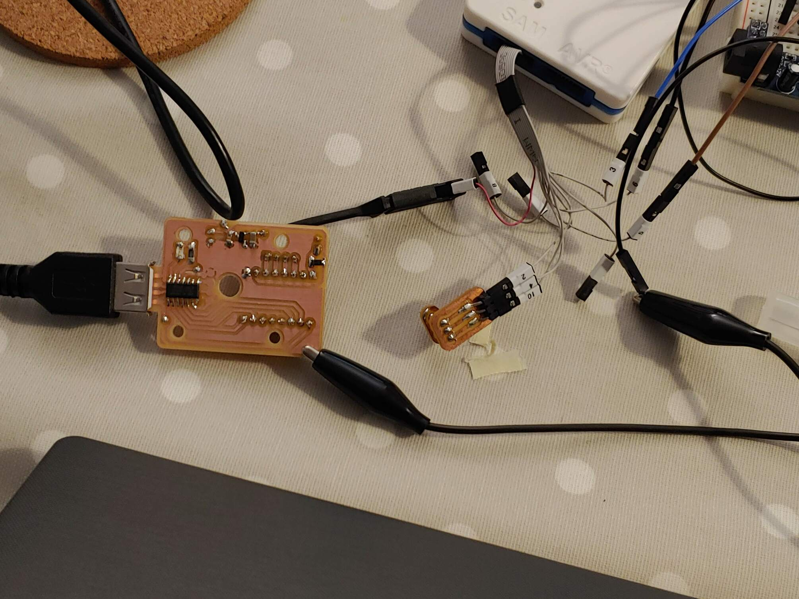

# Urumbu USB Stepper Motor

**This Project follows on from the work of Professor Neil Gershenfeld, Quentin Bolsee and Rob Hart at MIT. [Here](https://gitlab.cba.mit.edu/neilg/urumbu) is the original repository.**

## Table of Contents <!-- omit from toc -->

- [Introduction](#introduction)
- [Brief](#brief)
- [Design Aims](#design-aims)
- [PCB Design](#pcb-design)
- [Manufacturing](#manufacturing)
- [Programming](#programming)
  - [Flashing SAMD11 Firmware](#flashing-samd11-firmware)
  - [Adding the Arduino IDE Board Manager](#adding-the-arduino-ide-board-manager)
  - [The Arduino Code](#the-arduino-code)
  - [The Test Code](#the-test-code)
- [Motor Module Characteristics](#motor-module-characteristics)
  - [Current Draw](#current-draw)
  - [Motor Speed](#motor-speed)
  - [Motor Torque](#motor-torque)
- [Using the Module](#using-the-module)
- [Conclusion](#conclusion)
- [Further Work](#further-work)

## Introduction

In the final year of my Bachelors degree I completed a dissertation. This repository is a summary of that work. Included in the repository is all of the information and files to reproduce and use the modules which I designed.

Bangor FabLAB needed to develop methods to teach the Fab Academy curriculum. The curriculum includes two weeks of making machines that move. Students have a very limited time to complete these projects and so they needed a flexible framework which could be used to rapidly prototype motion systems.

Traditional motion systems have all of the components plugged into the controller board. This board has firmware code to control all of the components. While prototyping, it is common to want to add parts like extra motors or switches. With this approach, the controller board must be re-designed, manufactured and programmed. This is time-consuming, creates waste, breaks the creative flow, and requires substantial skills. Students only have one week to do their projects, and this approach is not suitable.

Professor Neil Gershenfeld and his colleagues Quentin Bolsee and Rob Hart have developed a modular solution to this problem called [Urumbu](https://gitlab.cba.mit.edu/neilg/urumbu). These modules are designed to plug into a computer via a USB port. The modules move in response to serial communications from the connected computer. To add more motors to an Urumbu-based machine, the user simply plugs another motor module into the PC and adds it to their code. This is much quicker and does not break the creative flow.

## Brief

I was tasked with equipping the FabLAB to teach the machine building exercises. This involved...
- Adapting the Urumbu design to meet our requirements.
- Manufacturing a set of modules.
- Testing and documenting the module characteristics to understand their capabilities.
- Demonstrating their use through building a motion system. 

## Design Aims

The original design used a DRV8428 motor driver. This motor driver causes the motor to generate noise. This driver is also surface-mount and so if the driver were to fail mid-project, it would be difficult and time-consuning to replace. 

With these issues in mind, I aimed to design a module with the following characteristics:
- Use a silent, user replaceable stepper motor driver (TMC2208, StepStick socketed package).
- Able to be mounted to the back of a NEMA 14 motor.
- Able to be manufactured in the FabLAB using their isolation milling process with FR1 board.

## PCB Design

After three breadboard prototypes and six circuit board revisions I arrived at this design.

The top section is the power section which takes the five volts from the USB connection and steps it down to a stable 3.3 volts for the microcontroller. The main use for the SAMD microcontroller is to interpret the information from the USB data lines and send the correct direction and step signals to the motor driver. The motor driver connects to the four motor pins and pulses them in sequence to advance the motor whenever it receives a step signal.

  

  

## Manufacturing

Images of the PCB were exported from KiCAD. Using [modsproject](https://modsproject.org/), these images were converted into toolpaths and saved in `./PCB_Design/Toolpaths`. Using the Roland SRM-20 CNC mill with a 0.4mm end mill, the traces were isolation milled out of a copper-clad FR1 board. A 0.7mm end mill was then used to drill the holes and cut the board outline. The components were soldered by hand using a soldering iron, as this is the best method for FR1 boards.

|   |  |
| --- | --- |

## Programming

### Flashing SAMD11 Firmware

The ["ArduinoCore"](https://github.com/mattairtech/ArduinoCore-samd/blob/master/bootloaders/zero/binaries/sam_ba_Generic_D11C14A_SAMD11C14A.bin) firmware was loaded on to the SAMD11 microcontroller to allow it to be programmed via USB. To do this, I used an Atmel-ICE programmer with the "mini-squid" cable and connected it to the microcontroller in the following way:

| SAM Programming Header Pin Number | Function | SAMD11C Pin Number |
| --- | --- | --- |
| 1 | VREF | 12 |
| 2 | DIO | 8 |
| 3 | GND | 11 |
| 4 | CLK | 7 |
| 5 | GND | 11 |
| 6 | Not Connected |   |
| 7 | Not Connected |   |
| 8 | Not Connected |   |
| 9 | GND | 11 |
| 10 |RST | 6 |

I used a crocodile clip to connect the ground connections to the ground plane. The voltage reference pin was connected via a test clip to the 3V jumper wire on the circuit board. The other connections were connected to a pogo-pin board which was held against the programming pads when the board was being programmed. The board recieved power through the USB connection. 

  

Atmel Studio was used to load the firmware onto the microcontroller. While holding the pogo pins to the pads, I selected `Device Programming > Apply` and the device was successfully connected to. On the "Memories" tab I selected the [firmware file](https://github.com/mattairtech/ArduinoCore-samd/blob/master/bootloaders/zero/binaries/sam_ba_Generic_D11C14A_SAMD11C14A.bin) and clicked "Apply" to write the firmware to the microcontroller.

  

### Adding the Arduino IDE Board Manager

The [Fab SAM board manager](https://raw.githubusercontent.com/qbolsee/ArduinoCore-fab-sam/master/json/package_Fab_SAM_index.json) was added to the Arduino IDE, following the [MIT guide](https://mtm.cba.mit.edu/2021/2021-10_microcontroller-primer/fab-arduino/). This allowed the Arduino IDE to be used to program the SAMD11C on the PCB.

### The Arduino Code

The Arduino code running on the Urumbu modules was very heavily inspired by the [original “serialstep” code](https://gitlab.cba.mit.edu/neilg/urumbu/-/tree/master/serialstep/serialstep.ino) used at MIT. The premise of the code is to continuously check whether any serial data has been sent via the USB connection. If the received data is an ’f’, the stepper motor will step clockwise (forwards). If the received data is an ’r’, the stepper motor will step anti-clockwise (reverse).

  

### The Test Code

The `./Test_Code/SerialStepControllerTest.py` code sends 'f' and 'r' characters via USB to the motor module to turn the shaft one rotation clockwise and then anti-clockwise repeatedly.

  

The `./Test_Code/SerialStepKeyboardControllerTest.py` code sends 'f' and 'r' characters via USB to the motor module to turn the shaft in response to the user pressing the arrow keys on the PC.

  

## Motor Module Characteristics

These documented characteristics should help anybody aiming to use these modules by giving them the information to assess whether these modules are capable of fulfilling their requirements.

### Current Draw

| Motor State | Lowest Current Draw (A) | Highest Current Draw (A) | Average Current Draw (A) | 
| --- | --- | --- | --- | 
| Idle | 0.13 | 0.19 | 0.16 |
| Moving | 0.31 | 0.37 | 0.34 |
| Moving with 5Ncm Load | 0.31 | 0.37 | 0.34 |

### Motor Speed

The maximum speed of the motor is approximately 2.64 revolutions per second or 158.5 revolutions per minute.

### Motor Torque

The motor was able to lift a mass of 100g at a distance of 6.8cm from the motor shaft. This gives a torque figure of 6.67Ncm.

## Using the Module

I then went on to demonstrate the use of these modules and test that they functioned as expected. To do this I designed, manufactured and programmed a crane motion system.

  

|   |  |
| --- | --- |

## Conclusion

In conclusion, I designed a set of stepper motor Urumbu modules to use a silent, user-replaceable motor driver. A set of modules was manufactured using standard FabLAB tools and parts. The current draw, speed and torque of the motor modules were tested and documented for future students to reference. I also designed and built a motion system to demonstrate the use of these modules. Overall this project was a success. The modules met the brief and will soon be used by Fab Academy students.

## Further Work

There are a few aspects of this project which could be furnter developed:
- Design more modules
  - Button Interface (Controller)
  - Limit Switch
  - LCD
- Write a Python Library to simplify the controller code that students need to write. They could use simple functions to control the modules, rather than dealing with the specifics of the serial communications and distance calculations. 